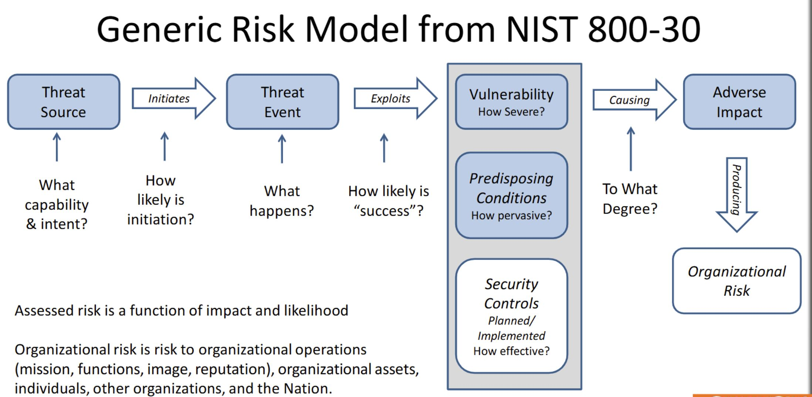

# BIS 572 - Week 2 Lecture 1 Notes

## Cybersecurity Risk

Risk Assessment should guide:
- Control implementations
- Resource allocation
- Incident response preparedness

You can either start with organizations goals and missions (top down) or start with systems and vulneribilites (bottom up)

---

<u>**Risk Related Definitions**</u>

>**Risk**: Combines probability of an event and its consequence.

>**Threat**: Anything (e.g., object, substance, human) that is capable of acting against an assetin a manner that can result in harm. Broadly, a potential cause of an unwanted incident.

>**Asset:** Something worth protecting, including people, information, infrastructure, finances and reputation

>**Vulnerability:** A weakness in the design, implementation, operation or internal control of a process that could expose the system to adverse threats from threat events.

>**Inherent risk:** The risk level or exposure without taking into account the actions that management has taken or might take (e.g., implementing controls)

>**Residual risk:** Even after safeguards are in place, there will always be residual risk, defined as the remaining risk after management has implemented a risk response.

---

<u>**Key Frameworks**</u>

- **ISO**: International Organization of Standardization
- **ISACA**: Information Systems Audit and Control Association
- **ICE**: Internatinoal Electrontechial Commission
- **NIST**: National Instutute of Standards and Technology

---

<u>**Thinking about Risk**</u>
- Liklihood/probability and impact/consequences
- Assessments factors for risk measurement
- Considering third-party risk
- Approaches for risk management

---

<u>**Making sense of Risk**</u>

- **Impact**: What is the organizational consequence?
- **Likelihood**: How likley is it to happen in a time period (probability)
    - **Vulnerability**: What makes the attack possible
    - **Threat**: What can act aginst our assests
        - **Capability**: What knowldege/skills are needed to carry out the threat
        - **Opporunity**: What resources does an attacker need to attack
        - **Intent**: Why would the attacker attack? What would they gain

---

<u>**Model the Attack**</u>

- **Who**: Attackers, errors, infastructure failures, natural distasters
- **How**: Physical VS Cyber attack, non-adversarial
- **Why**: Oops, intel, political gain, money

---

<u>**Generic Risk Model From NIST 800-30**</u>

---

<u>**Exposure Calculations**</u>

$$\text Likelihood \times \text Impact = \text Exposure$$

**Examples**

10% risk of something happening in a 10 year time window with an impact of $120,000

$$10\% \times \$120,000 = 12,000$$

$12,000 of exposure over the next 10 years.

---

<u>**Risk Mitigations Strategies**</u>

- **Avoidance**: Eliminating the risk entirely by not engaging in the activity that causes it
- **Mitigation**: Taking steps to reduce the likelihood or impact of the risk
- **Transfer**: Shifting the risk to a third party (insurance)
- **Acceptance**: Acknowledging the risk and choosing to accept it without taking immediate action

--- 

<u>**Cybersecurity Approaches**</u>

- **Ad Hoc (Bad)**: An unstructured, reactive approach to risk or security, where issues are addressed only after they occur  
- **Compliance-based (Inevitable)**: A reactive approach focused on meeting minimum legal or regulatory requirements, often checking boxes without fully addressing real risks
- **Risk-based (Best)**: A proactive, strategic approach that prioritizes actions based on the likelihood and impact of risks, aligning with business objectives for optimal protection

--- 

## Cyberattack Types and Vectors

<u>**Attack event occurences** </u>
- **Attack**: Threat agent employs an attack vector to target an asset through a vulnerability
- **Non-adversirial**: a vulnerability results in an event that
damages an asset

--- 

<u>**Anatomy of the Attack**</u>

- **Attack Vector**: A path or route used to gain access to a target asset
- **Exploit**: a software tool designed to take advantage of a flaw in a computer
system, typically for malicious purposes such as installing malware
- **Payload**: The harmful data/code to be delivered by the attack
- **Vulneribility**: A weakness in the design, implementation, operation or internal control
of a process that could expose the system to adverse threats from threat
events
- **Target**: Person or asset selected as the aim of an attack

---
<u>**Malware – By Technique**</u>

- **Viruses**: Code that replicates itself (intervention required)
- **Network Worm**: A virus that can spread itself across a network
- **Trojan Hourse**: Malware that hides in another application
- **Botnets**: Numerous computers able to act in coordinated attacks(often without their owners knowing it) – often used for
DDOS – Distributed Denial of Service attacks

# BIS 572 - Week 2 Lecture 2 Notes

## Polices

**Senior management** devlops policy. The **board of directors** accepts and validates said polices. 

Polices happen over a lifecycle:
- Devlop, maintain, approve, exceptions
- Annual review is expected good practice
- Exceptions will be needed - say how this happens

---

<u>**Four types of police documents** </u>:
- **Polices**: Required and prohibited activities and behvaiors
- **Standards**: Interpret the polices in specific situations
    - More specific than polices
- **Procedures**: Provides details on how to comply with polices and standards
- **Guidelines**: Provide general guidance on issues such as "What to do in particular circumstances". These are not requierments to be met but are strong recommendations

---

**Polices** need metrics to verify they are working.

---

<u>**Security Incident Response** </u>
- **RPO**: Response Point Objective - Specifices how much data can you lose
    - EX: Backup should be up and running within 24 hours
- **RTO**: Resonse Time Objective - Specifies how long you willing to wait before service is resotred
    - EX: Can lose 24 hours of data and still survive

---

## Controls

<u>**Four Three of controls**</u>:

- **Preventive**: Prevents the vulnerability
    - Password rules, background checks
- **Detective**: Detects the vulnerbility
    - Configuration alerts, account review
- **Corrective**: Corrects the vulernbility
    - Backups, executable replacement

What is it that provides protection?

Was there human intervention?

There are two types of **preventive** and **detective** controls: **Manual** and **automaic**. Depends on where the protection happens. Is a **human intervention involved**? Password rules would be automatic since the system won't let you input a weak password. If automatically prevents it without human intervention for you to get the protection. If for example an alert is sent out, does a human need to review it for there to be protection? If so, that is a manula control. 

---

